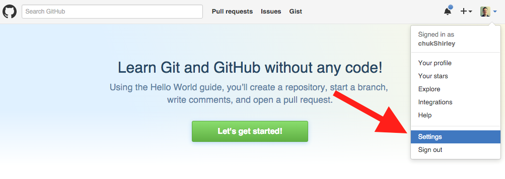
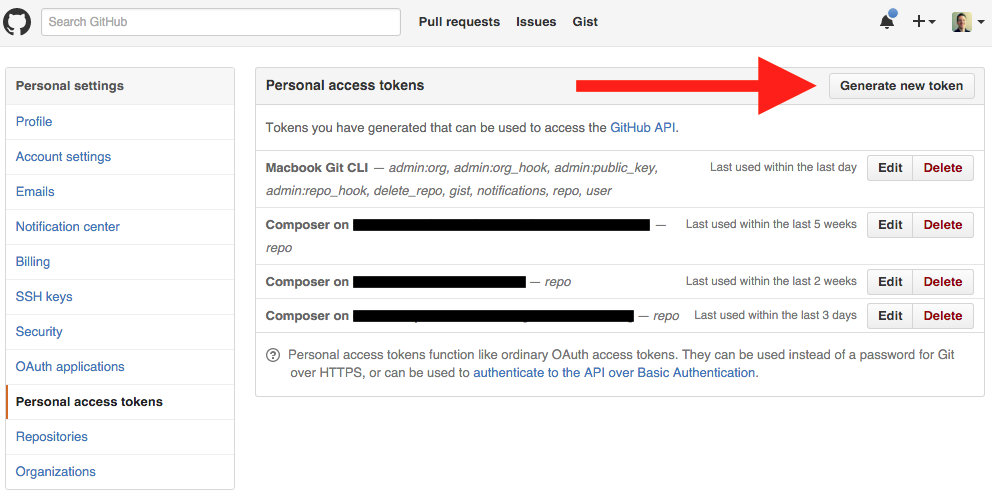
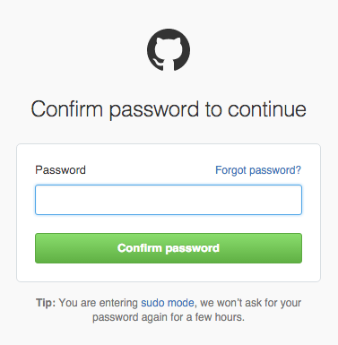
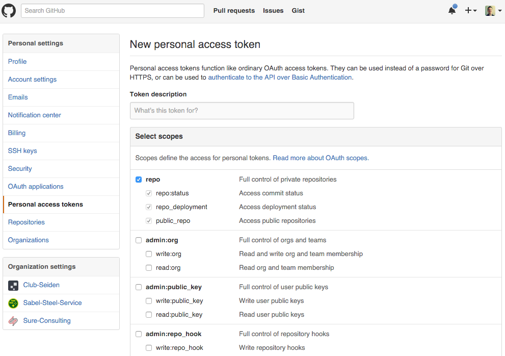

### Generate a personal access token on GitHub

* Log in to GitHub
* Click on your profile in the top right corner then "settings"
* Click on "Personal access tokens" and generate the token  
  
    
* Re-enter your password    
    
* Name your token something that will indicate how it's used and check the box next to "repo" and click "Generate token"  
  
  
__Note you will not be able to access your token again. So make sure to copy it to your clipboard or some other method of temporarily recording it__  