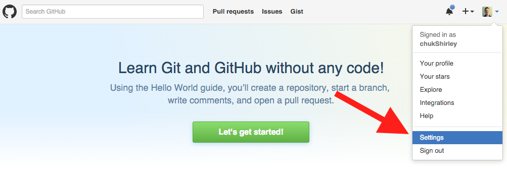
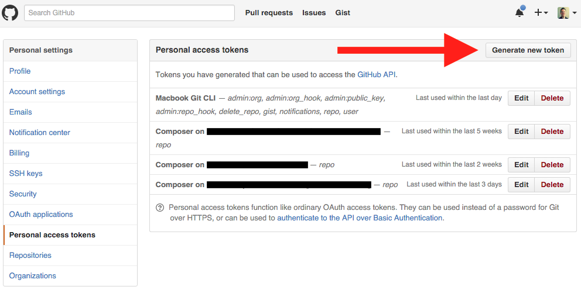
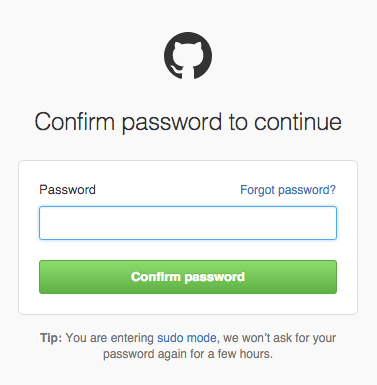

## Install Composer

* [Enter PASE environment](enter-pase-environment.md)  
* Navigate to installation destination  
```sh
$ cd /usr/local/zendsvr6/bin
```  
* Run installation script  
```sh
$ php-cli -r “readfile('https://getcomposer.org/installer');” | php-cli
```  
__Note: If running this statement produces an OpenSSL error message, follow [these instructions](setting-up-ssl-peer-certificates.md)__  
* For convenience you can rename composer.phar to composer (optional)  
```sh
$ mv /usr/local/zendsvr6/bin/composer.phar /usr/local/zendsvr6/bin/composer
```  
    
Composer Installation
GitHub API Token: e5ecb1116e42e69792438d78bbb05eddff86d1f2

Composer uses https or ssh to clone a project’s dependencies. Https is faster since it downloads a zipped copy of the repository, 
but if you want Composer to use https you have to generate a GitHub token as described here. 
* Log in to GitHub and generate the token  
  
    
Re-enter your password  

Name your token something that will indicate how it's used

* Copy the token to your clipboard
* [Enter PASE](enter-pase-environment.md)
* Navigate to PHPCI directory (only necessary if you’ve installed Composer local to the PHPCI project)
```sh
$ cd /www/phpci
```
* Add the token to the composer configuration
```sh
$ composer config -g github-oauth.github.com <oauthtoken>
```